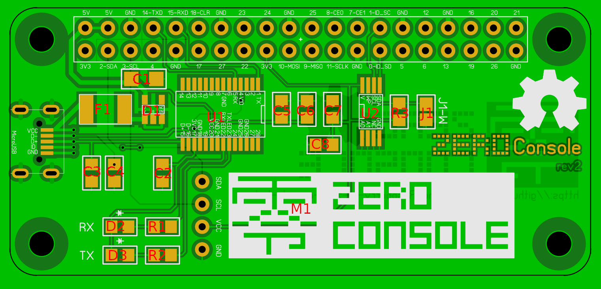

# Raspberry zero console HAT
USB - UART interface for Raspberry Zero

  

| component  | Value  | Size  | Note  |
|---|---|---|---|
| C1  | 100u  | 1206  |   |
| C2  | 10u  | 0805  |   |
| C3  | 47p  | 0805  |   |
| C4  | 47p  | 0805  |   |
| C5  | 100n  | 0805  |   |
| C6  | 10u  | 0805  |   |
| C7  | 100n  | 0805  | optional  |
| C8  | 10u  | 0805  | optional  |
| R1  | 270R  | 0805  |   |
| R2  | 270R  | 0805  |   |
| R3  | 10K  | 0805  | optional  |
| D1  | max40200  | SOT-23-5  | ideal diode  |
| D2  | Red LED  | 0805  |   |
| D3  | Green LED  | 0805  |   |
| F1  | 6v 1.5A Poly fuse  | 1812  |   |
| U1  | FT232RL  | SSOP28  |   |
| U2  | AT24C256C  | TSSOP8   | optional  |
| M1  | 0.91" 128x32 Oled  | <a href="https://www.aliexpress.com/item/1pcs-0-91-inch-OLED-module-0-91-blue-OLED-128X32-OLED-LCD-LED-Display-Module/32777216785.html">Aliexpress</a>  | optional  |
| MicroUSB  | Female micro USB connector  | <a href="https://www.aliexpress.com/item/10PCS-YT2011Y-Micro-USB-5P-4-feet-5-Pin-USB-socket-plug-board-type-plate-insert/32826417729.html">Aliexpress</a>  | optional  |
| J1  | n/a  | n/a  | optional - Enable write mode for EEPROM  |
*Optional parts : This HAT can be attach with 0.91" 128x32 Oled display and EEPROM for Raspberry device-tree.